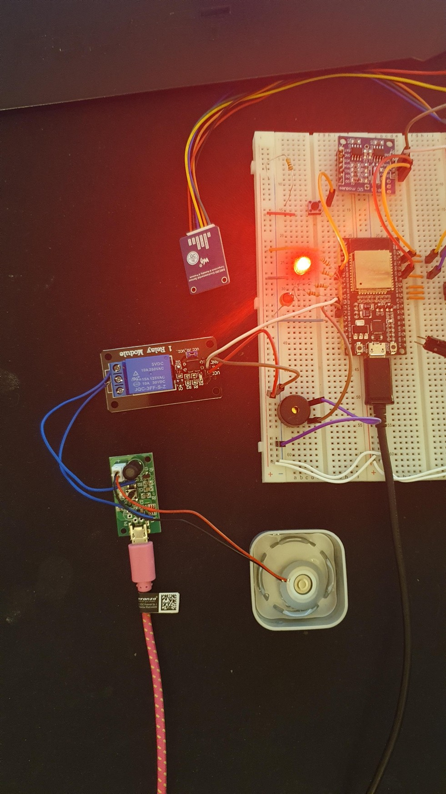
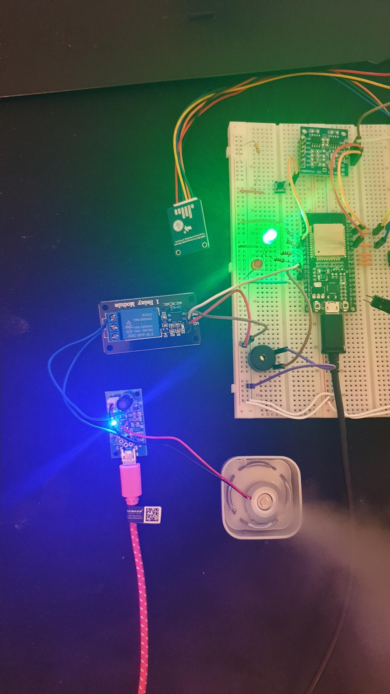
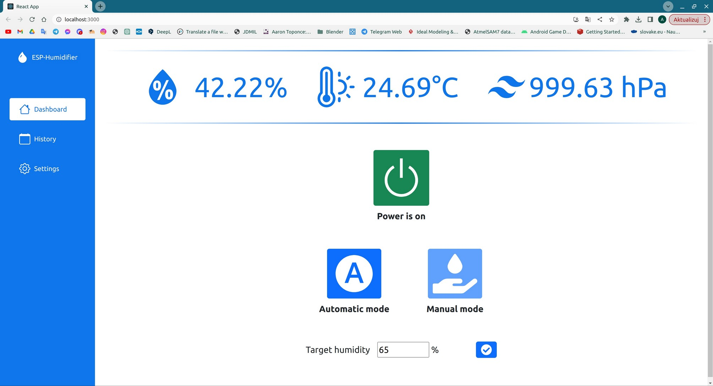
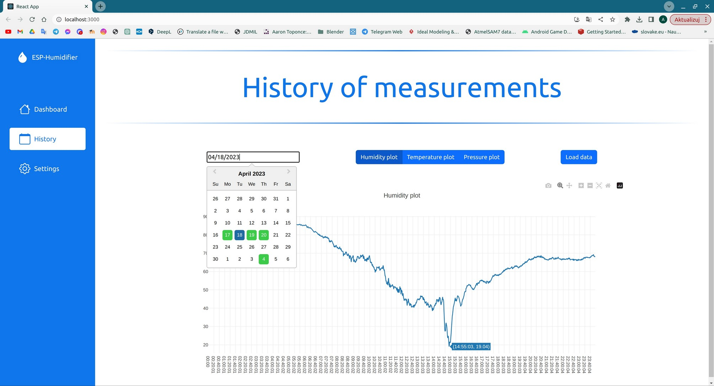
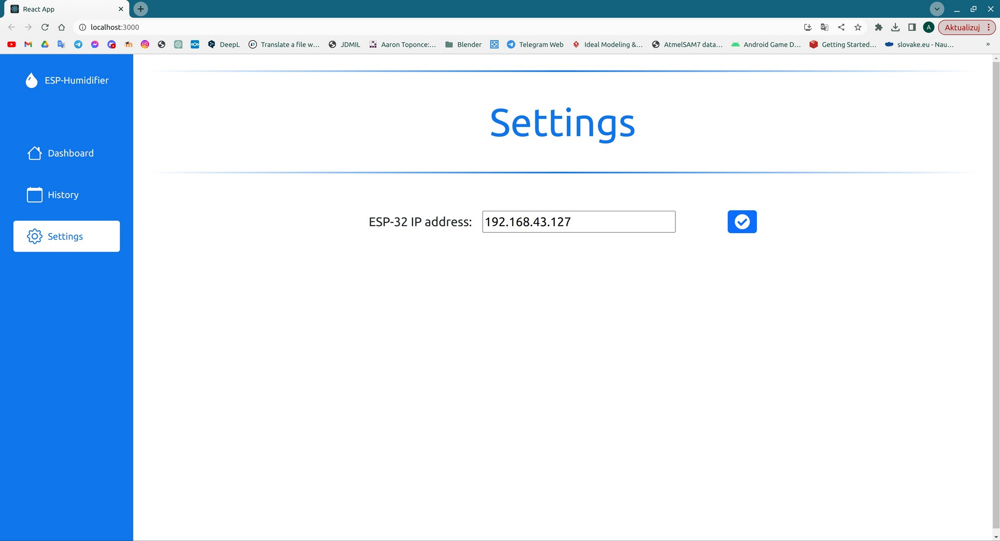
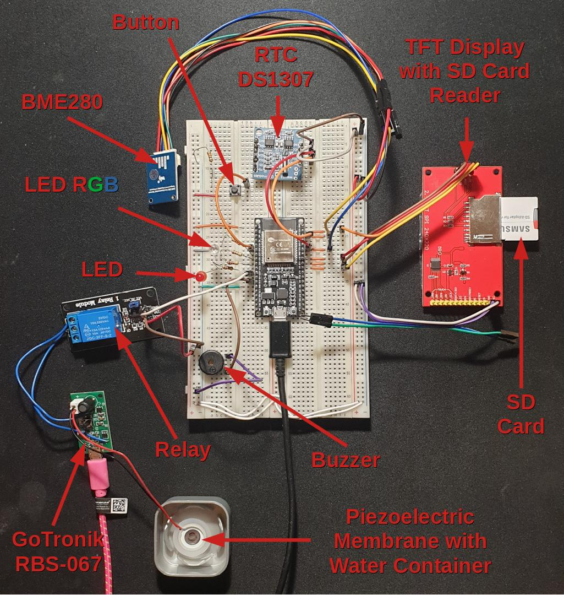
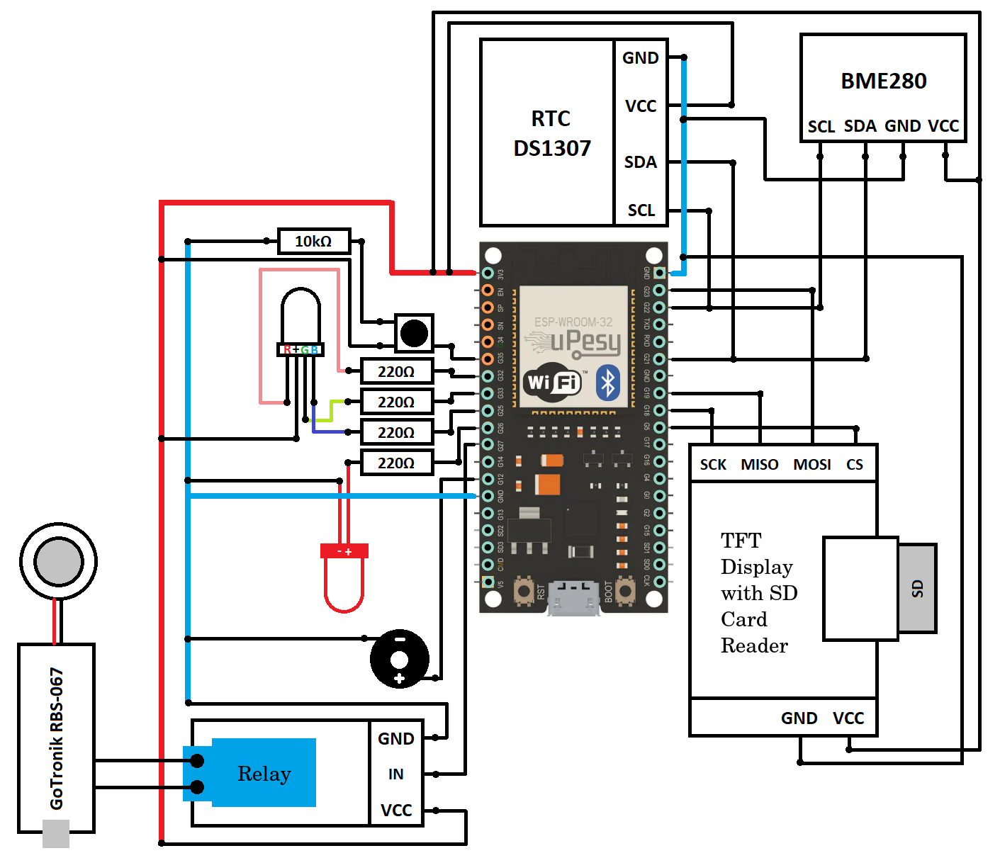

# Smart Humidifier with Data Logging and Remote Control Using React and Arduino/ESP

## Project Overview

The project concerns a smart air humidifier based on the ESP32 microcontroller. The humidifier operates in two modes – automatic and manual. The device can be controlled either manually or via a web application. It also features an additional functionality to record humidity, temperature, and pressure data on an SD card, with the option to review the recorded data in the application.

## Project Functionality Outline

Upon connection to a power source, the ESP32 module immediately initializes all attached components and connects to the Wi-Fi network. A red LED remains illuminated until the device completes initialization. Once successfully started, the LED turns off.

When the device is ready for operation, an RGB LED lights up in red (see figure 1). At this point, the ESP32 module begins background operation, taking humidity, temperature, and pressure measurements every minute and appending entries to a .csv file on the SD card. For each day of operation, a new file is created, named according to the date (e.g., “2023-04-17.csv”). Each entry logs the time and measurement values.

The humidifier can be switched on and off manually via a button on the breadboard. When activated, the device enters automatic mode, signaled by the RGB LED glowing green (see figure 2). Humidification can also be activated through a web application (developed in JavaScript using the React.js library), which provides an additional option to select the operating mode. In automatic mode, the target humidity is set to 50%, meaning that the device will automatically turn on the atomizer module when humidity drops below 50% and turn it off when this level is exceeded. Manual mode operates similarly, allowing the user to set a custom target humidity level. Manual mode is indicated by a blue LED light.

The GoTronik RBS-067 module is connected to a separate power source and controlled via a relay. Actions such as enabling and disabling humidifier modes, switching modes, and setting the target humidity level are accompanied by a buzzer sound.

The web application features three tabs: Dashboard, History, and Settings. The Dashboard serves as the main page, displaying updated measurements of humidity, temperature, and pressure every 5 seconds. Here, users can also activate the humidifier, choose the operating mode, and, in manual mode, set the target humidity level (see figure 3). The History tab allows users to select a date from a calendar, with green highlighting indicating days for which measurement files exist on the SD card. Upon selecting a date, users can view graphs of recorded humidity, pressure, and temperature values for the chosen day (see figure 4). The Settings tab allows users to configure the IP address assigned to the ESP32 module (see figure 5). Upon first launching the application, users are prompted to enter this IP address to start using the humidifier.

  
   *RGB LED illuminated in red – device ready for operation*

  
   *RGB LED illuminated in green – operating in automatic mode*

  
   *Dashboard tab – displaying current humidity, temperature, and pressure values, as well as active manual mode with target humidity set to 65%*

  
   *History tab – showing humidity graph for 18.04.2023*

  
   *Settings tab – displaying field to set the assigned IP address of the device*

## Modules and Components Used		

The following components were used for the project:
- ESP32 module (ESP32 DevKit ESP-WROOM-32 V2),
- BME280 sensor module for temperature, pressure, and humidity,
- SD card reader module (integrated with a 2.4” TFT SPI display (240x230) with ILI9341 controller),
- Real-time clock module RTC DS1307 24C32,
- GoTronik RBS-067 atomizer module (piezoelectric membrane with generator),
- Relay module (1 channel),
- Buzzer,
- Button,
- RGB LED,
- Red LED,
- Four 220Ω resistors,
- One 10kΩ resistor,
- Two breadboards,
- Two USB MICRO B power cables,
- SD card,
- Jumper wires.

## Component Connection Method
Figure 6 shows a practical method for connecting all components. Figure 7 provides a detailed wiring diagram with pin designations.

  
   *Practical connection method for components with designations*

  
   *Wiring diagram for all components with pin designations*